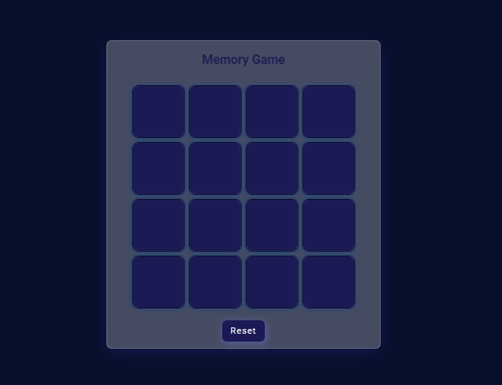

# Memory Game

This is a dynamic memory game project created using HTML, CSS (including Tailwind CSS), and jQuery. The game is designed to test and improve your memory by matching pairs of cards.

## Features

* Random card generation for a unique gameplay experience each time.
* Interactive card flipping animation.
* Responsive design for seamless gameplay on various devices.
* Win condition: Match all pairs of cards to win the game.

## Technologies Used

* [HTML]('https://developer.mozilla.org/en-US/docs/Web/HTML')
* [CSS (including Tailwind CSS)]('https://tailwindcss.com/')
* [jQuery]('https://jquery.com/')

## Usage

1. Clone the repository to your local machine.
2. Open the index.html file in a web browser.
3. Start playing the memory game by clicking on the cards to reveal their symbols.
4. Match pairs of cards to clear them from the board.
5. Continue until all pairs are matched to win the game.

## Screenshots

## Demo
You can see a live demo of the game [here]('https://rohanbasnet12.github.io/Memory-game/').

## Contributing
Contributions are welcome! If you find any issues or have suggestions for improvements, feel free to open an issue or submit a pull request.

## License
This project is licensed under the [MIT License].
